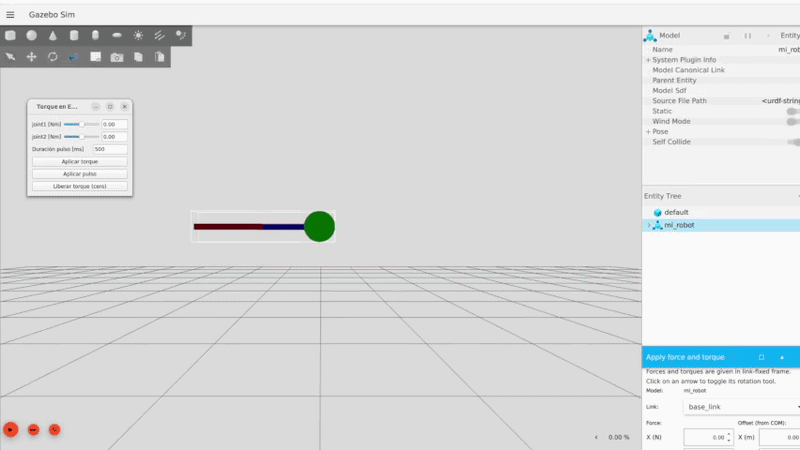

# Ejercicio 5

## Objetivo

Simular en Gazebo el doble péndulo de `clase5` en régimen **caótico** (sin fricción, sin límites de velocidad artificiales) y poder aplicarle torque manualmente por joint desde una GUI.



## Ajustes para comportamiento caótico del doble péndulo (`dp_params.xacro`)

- `damping1`/`damping2`: `0.1` → `0.0`; `friction1`/`friction2`: `0.01` → `0.0` (rozamiento viscoso/Coulomb a cero, para no disipar la energía).
- `qp1_max`/`qp2_max`: `5.0` → `100.0` rad/s. Con `5.0` la simulación tocaba el límite de velocidad y quedaba en un ciclo periódico artificial en vez de caótico.
- `dp.xacro`, `joint1`/`joint2`: se cableó `<initial_position>$(arg q1_ini)</initial_position>` (y `q2_ini`) dentro de `<axis>` - antes `q1_ini`/`q2_ini` estaban declarados en `dp_params.xacro`, así que el péndulo siempre arrancaba en `0.0` sin importar su valor.

## Entrar en el contenedor
```bash
cd docker
docker compose up
xhost + && docker compose exec dev bash
```

## Build

```bash
colcon build --packages-select primer_paquete_2026 --symlink-install
source install/setup.bash
```

## Ejecución

```bash
ros2 launch primer_paquete_2026 ejercicio5.launch.py
```