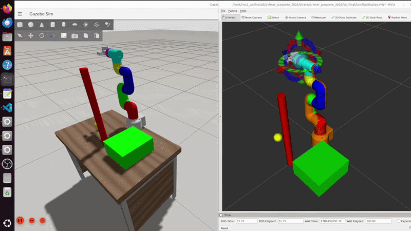

# TP - Manipulación con MyCobot320

Escenario de manipulación con el MyCobot320 y la pinza `adaptive_gripper`, usando `ros2_control` y MoveIt2: mundo de Gazebo con 3 objetos sobre un escritorio, esos mismos objetos como obstáculos en la Planning Scene, y un script que lleva el efector final a una pose de pre-grasp planificando y ejecutando una trayectoria que los esquiva.




## Video 
[Presentación en drive](https://drive.google.com/file/d/1rGSL3_CuDVEcMvKlU2jjPjB1rFEzlIZ7/view)

## Archivos involucrados
- `launch/tp_final.launch.py`
- `tp_final/robot_description/mycobot_320_m5_2022/mycobot_320_m5_2022.xacro` (fusión brazo + garra)
- `tp_final/config/mycobot_320_m5_2022/ros2_controllers.yaml`
- `tp_final/config/mycobot_320_m5_2022/moveit/mycobot_320_m5_2022.srdf`
- `tp_final/worlds/mundo_escritorio.world` (variante con los 3 objetos)
- `tp_final/scripts/pregrasp_goal.py`

## Ejecución

```bash
# 1. Compilar
colcon build --packages-select primer_paquete_2026 --symlink-install
source install/setup.bash

# 2. Lanzar la simulación completa (Gazebo + ros2_control + MoveIt + RViz)
ros2 launch primer_paquete_2026 tp_final.launch.py
```

Al arrancar, a veces `joint_state_broadcaster` no llega a activarse solo por una carrera de timing contra Gazebo.

```bash
ros2 control set_controller_state joint_state_broadcaster active
```

Con la simulación corriendo, en otra terminal:

```bash
# 3. Enviar el goal de pre-grasp (planifica y ejecuta esquivando los 3 objetos)
ros2 run primer_paquete_2026 pregrasp_goal.py
```

## Build

```bash
colcon build --packages-select primer_paquete_2026 --symlink-install
```
